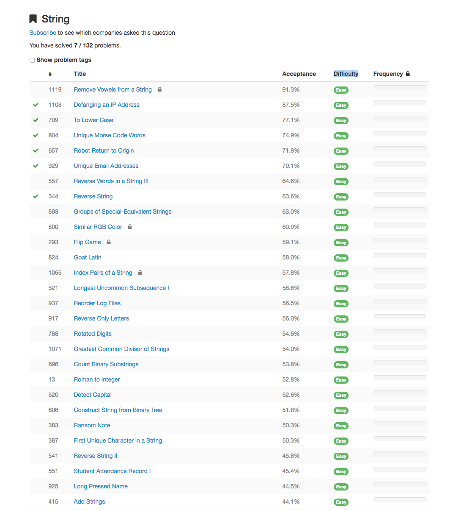
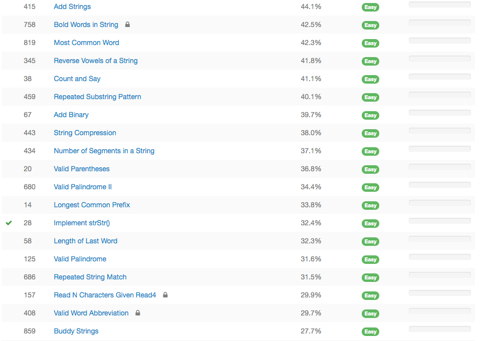

Table of Contents
=================
   * [Notebooks](#notebooks)
   * [Leetcode String Easy](#leetcode-string-easy)

# Notebooks
- easy 1 and 2: https://nbviewer.jupyter.org/github/bhishanpdl/Leetcode/blob/master/string/string_easy/leetcode_string_1_2.ipynb

# Leetcode String Easy

